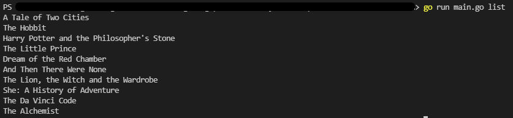
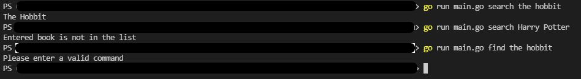

# CommandMe App

> A simple terminal app that lists or searches books.

## Table of Contents

* [Setup](#setup)
* [Usage](#usage)
* [Screenshots](#screenshots)
* [Contact](#contact)
* [License](#license)

## Setup

To run this project you must have Golang installed in your PC.

## Usage

There are 2 commands you can write after running the main.go file:

* "list" command: Lists all books that system has.
* "search" command: Searches given book. If given book is in the list returns book's name, otherwise returns info about that book is not in the list.

```golang
// returns all books
go run main.go list

// returns "The Hobbit"
go run main.go search the hobbit

// returns "Entered book is not in the list"
go run main.go search Harry Potter
```

## Screenshots




## Contact

Created by [@horzu](https://horzu.github.io/) - feel free to contact me!

## License

[MIT](https://choosealicense.com/licenses/mit/)
